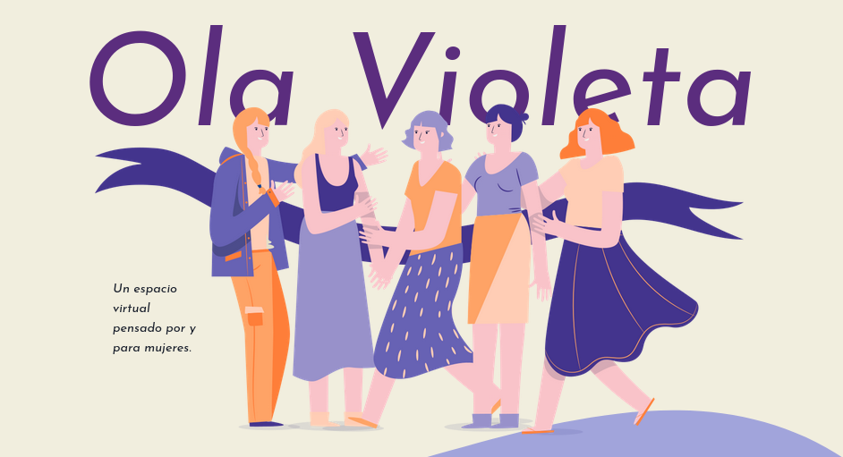
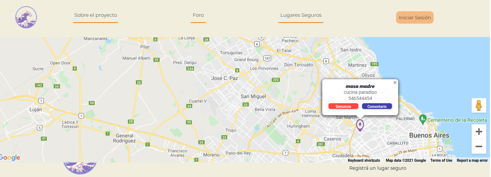

# 
 ___<a href="https://pf-grupal.vercel.app/">OlaVioleta</a>___   

  

    

## __Bienvenidx a OLaVioleta.__

Somos un equipo de 7 desarrolladoras web que nos unimos para crear el proyecto OlaVioleta.

OV esta diseñada para que los establecimientos puedan brindarte apoyo en caso de estar en peligro o tener la sospecha de estarlo.
Puedes entrar al un establecimiento y disfrutar de un espacio comodo y seguro para ti.
Es un espacio web que en el que, a través de tu ubicación en tiempo real, te muestra lugares seguros cerca de ti.

  

    
  

* Tambien puedes agregar un lugar seguro.

* Si el lugar te encantó, puedes dejar una reseña para que mas chicxas disfruten del lugar.

* Y si algo no te gusto, o te sentiste incomoda con alguno de estos lugares, puedes tildarlos para que mas chicas lo vean.

  

      
  

* ### Tenemos tambien una seccion de noticias, entrevistas y mujeres en salud. 

    

## Desarrolladorxs:

* Mora
* Flor
* Fer
* Vero
* Agus
* Caro
* Any  