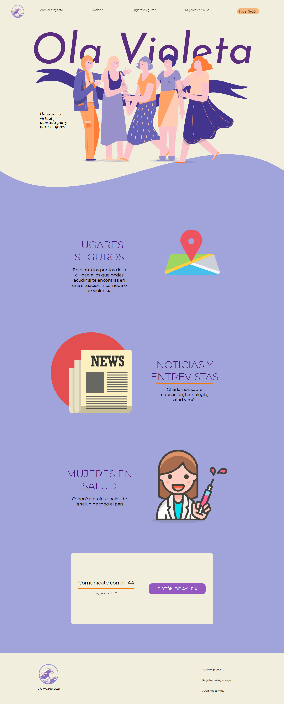

# Ola Violeta 

Es un desarrollo de aplicación web full-stack hecha por mujeres, con la finalidad de armar una red de lugares seguros, formando una comunidad que contribuya a disminuir la violencia machista en la sociedad. 

## La aplicación se conforma por tres ejes principales:

- `El primero`  es el registro de lugares, que se evalúan como seguros, en el mapa de Google con geolocalización en tiempo real, para que las mujeres puedan acudir en caso de necesitarlo.
- `El segundo` eje se conforma por la sección de 'Mujeres en Salud', en la cual las profesionales en Salud, pueden publicar sus datos para que las mujeres puedan elegir, en base al registro, con cual profesional atenderse.
- `El último eje` se trata de un espacio para publicar entrevistas y noticias sobre mujeres, para que puedan dejar opiniones, informarse e identificarse con otras mujeres.


Esta web app fue desarrollada con tecnologías como:
- `ReactJS` 
- `Redux` 
- `CSS3-Modules` 
- `NodeJS`
- `Express`
- `Sequelize` 
- `PostgreSQL` 
- `Google Maps API` 




## Demo Website
 Demo : https://pf-grupal.vercel.app


## Localmente corre:

`Front-end`

```sh
$ npm install
$ npm run start
```

`Back-end`

```sh
$ npm install
$ npm run dev
```

`Variables de entorno usadas`

```sh

PORT="yourPort"
DB_NAME="yourDBName"
DB_USER="yourDBUser"
DB_PORT="yourPort"
HOST="localhost"
DB_HOST = "localhost"
DB_PASSWORD= "yourPassword"
REACT_APP_API_KEY="yourAPI_KEY"

AUTH0_CLIENT_ID=yourClientID
AUTH0_DOMAIN=yourAuthDomain
AUTH0_CLIENT_SECRET=yourClientSecret
AUTH0_USER_DATA_BASE_NAME=yourUserDataBaseName
AUTH0_AUDIENCE = yourAuthAudience

GMAIL= yourNameProject@gmail.com
GMAIL_PASS=yourpassword-nameProject
```

